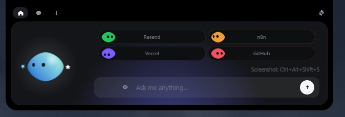
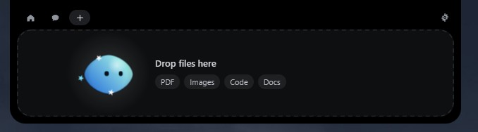
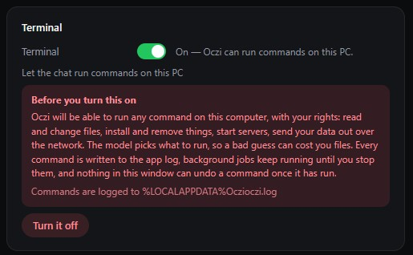
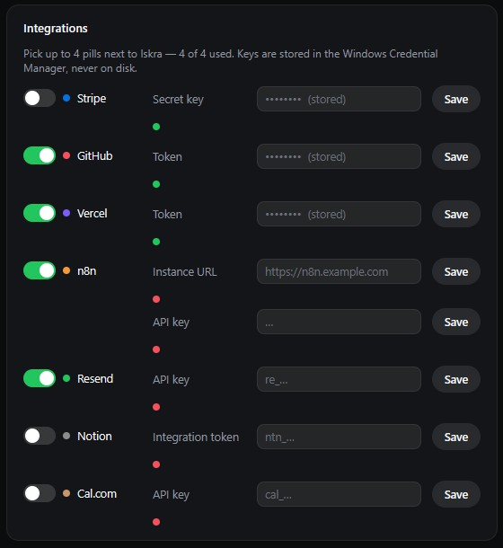

<div align="center">


# Oczi for Windows

**No notch on a PC — so Iskra lives at the top of your screen instead.**

Chat through the **DeepSeek API**, drop a file, keep an eye on your services —
without leaving what you're doing.




</div>

---

## Install

Download **`Oczi-Windows-0.1.3-setup.exe`** from
[Releases](https://github.com/Adamowyy/oczi/releases/latest). It installs for the
current user only — no admin prompt.

The installer is **not code-signed yet**, so expect a SmartScreen warning
(*More info → Run anyway*). Microsoft Defender has also flagged it once as
`Trojan:Win32/WacatacH!ml` — a machine-learning false positive on unsigned NSIS
installers, reported to Microsoft. If that is not acceptable, [build it
yourself](#build-it-yourself): a few minutes, and you get the same thing from
source.

## Using it

| What you do | What happens |
|---|---|
| Move the mouse to the very top-centre of the screen | Iskra peeks out |
| Click the small island | It opens |
| Click Iskra | She gets annoyed. Three times in a row and she goes dizzy |
| Rest the pointer on Iskra for two seconds | Hearts |
| Drag a file onto the island | Iskra turns into a box, swallows it, then offers to answer questions about it |
| `Esc` | Closes the island |
| Tray icon | Open, Settings…, Pause, Quit |

Everything else happens on its own: a finished integration pulse badges its pill,
and your services sit in the coloured pills next to Iskra.

The UI is English by default; **Settings… → Language** switches it to Polish, and
the island follows — the whole page is re-loaded, because the views bake their
texts when they are built. Adding another language is one table in
`src/core/i18n.ts`, and `npm run check:i18n` keeps the tables in step.

## Screenshots



*Drop a file on her and she takes it — the original is copied into an inbox, never touched.*



*Terminal access is off by default, and says what it will do before it does it.*



*Integrations: each service gets a pill with its own little character. Keys never leave the Credential Manager.*

## Terminal

**Settings… → Terminal** gives the chat hands on this machine: `run_terminal`
runs a command through `cmd.exe` and waits for it, `terminal_job` starts a long
one (a server, a build, a download) whose output goes to a log,
`terminal_output` reads that log and `terminal_kill` stops it.

It is **off by default**, and turning it on takes two clicks: the switch shows
what the model would be able to do — read and change files, install and remove
software, start servers, send data out — and only the second click turns it on.
Once it is on, Oczi can run anything your account can run; a bad guess by the
model is a real change to your machine.

What keeps it honest: every command is written to
`%LOCALAPPDATA%\Oczi\oczi.log` before it runs, commands are killed when they
overrun their timeout (default 30 s, max 300 s), output handed to the model is
clipped, and background jobs keep running until you stop them or quit the app.
The prompt tells the model to prefer read-only commands and to ask before
anything destructive — that is a strong hint, not a sandbox. No sandbox.

## Chat

**Settings… → DeepSeek** takes your API key and picks the model — `deepseek-flash`
(one second answers) or `deepseek-v4-pro` (stronger, dearer), plus a **Thinking**
switch that makes either one reason before answering. The chat runs against the
OpenAI-compatible `https://api.deepseek.com/chat/completions` endpoint, and it runs
in Rust: the key and a dropped file's bytes never cross into the web view.

**Settings… → Internet** gives the chat live web access, on by default. The model
gets two tools — `web_search` and `fetch_url` — and the app performs the lookups:
when a question needs today's data (news, prices, weather, releases, anything after
the model's training cut-off) it searches instead of guessing, and it answers with
the source URLs. The default backend is **DuckDuckGo**, which needs no account;
**Brave** and **Tavily** keys are accepted if you prefer their results. Search
results and page text are treated as untrusted data, and `fetch_url` refuses
loopback and LAN addresses.

A dropped file is inlined as text, so the chat can read code, logs and configs.
Images and PDFs are named but their contents are not attached yet, rather than
being silently pretended across.

Keys live in the **Windows Credential Manager**, never on disk and never in the
interface — the island can only ask whether a key exists. Same for every
integration key.

No telemetry. The only network requests Oczi makes are to the services you
configure yourself.

## Build it yourself

You need [Rust](https://rustup.rs), [Node 20+](https://nodejs.org), and the
**MSVC build tools** (Visual Studio Build Tools with "Desktop development with
C++"). WebView2 ships with Windows 10/11.

```powershell
cd windows
npm install
npm run tauri dev      # live-reloading development build
npm run pack           # builds the installer and drops it in windows/release/
```

Without the MSVC build tools the GNU toolchain works too: rustup with the
`x86_64-pc-windows-gnu` host plus a MinGW-w64 GCC (WinLibs, **MSVCRT** runtime,
which is the CRT rust's `windows-gnu` target links against). Nothing else is
needed — `windows/.cargo/config.toml` carries the single linker flag that build
requires, and it is scoped to that target so MSVC builds ignore it.

`npm run dev` alone serves the front end in an ordinary browser, which is enough
to work on the island's looks. It also serves `dev/upload-preview.html`, which
replays the whole file-drop choreography on a loop — the one part of the UI that
otherwise needs a real drag from Explorer to see. Neither page ships in the app.

`npm run pack` leaves two files in `windows/release/`, the same names the release
workflow publishes:

```
Oczi-Windows-X.Y.Z-setup.exe    the versioned installer
Oczi-Windows-setup.exe          the same file under the rolling name
```

Installing is optional — `target/release/oczi.exe` runs on its own. There is no
window in the taskbar and no console: the island at the top of the screen and the
Iskra in the notification area are the whole app, and Quit lives in its menu.

No sounds ship yet — the audio layer is in place and silent, and adding a sound
pack is a matter of dropping WAVs in and listing their names in `SOUND_NAMES`
(`src/core/sound.ts`).

The app icon and the tray icon are drawn in code from Iskra's own outline in
`src/bot/skin.ts`, so the icon and the character can't drift apart:

```powershell
npm run icons          # regenerates src-tauri/icons from scripts/gen-icons.mjs
```

### Layout

```
windows/
  src/                 island front end (TypeScript, no framework)
    bot/               Iskra: her skin, the character engine, the greeting
    island/            state machine, hooks, integrations
    views/             every island view
    settings/          the settings window
  src-tauri/           Rust backend: window, DeepSeek chat, pollers
  scripts/             icon generator
```

### Log

`%LOCALAPPDATA%\Oczi\oczi.log` — drag/drop and snip activity, poller
problems. It stays on your machine.

## Notes

- No notch, so the island lives at the top centre of the screen and retracts into
  the top edge instead of hiding in a notch.
- The chat talks to **DeepSeek**, not the Claude API, and there is no Claude Code
  integration at all: no session ticker, no permission approval from the island.
- Not in this version: sending a file by email, dragging Iskra onto a window to
  attach it as context, and jumping to a specific terminal window.
- Cal.com shows the next bookings as a list rather than a calendar view.
- Licence: the code is MIT (see the root [LICENSE](../LICENSE)); the Oczi name,
  the Iskra character and the icon are reserved
  ([LICENSE-ASSETS.md](../LICENSE-ASSETS.md)).
